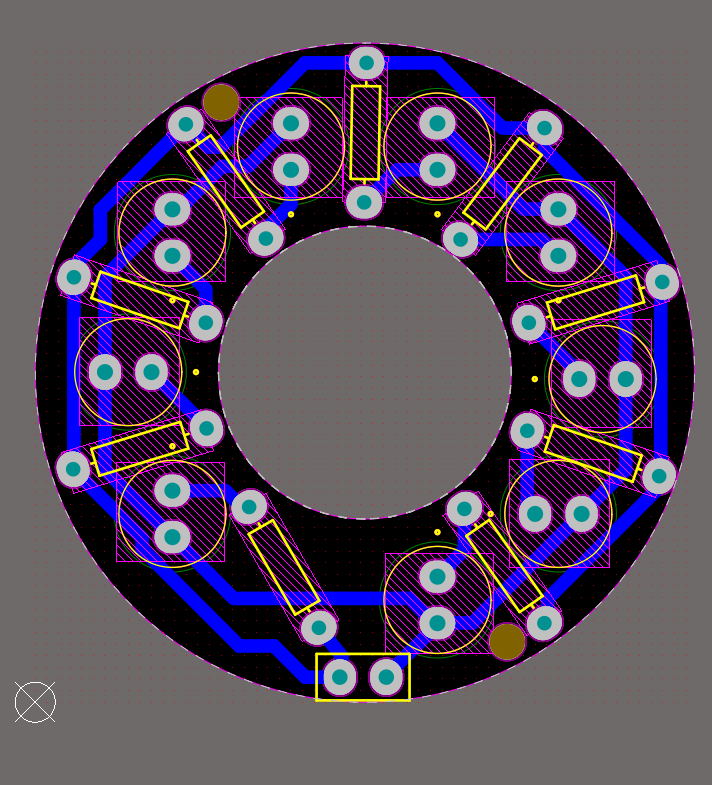
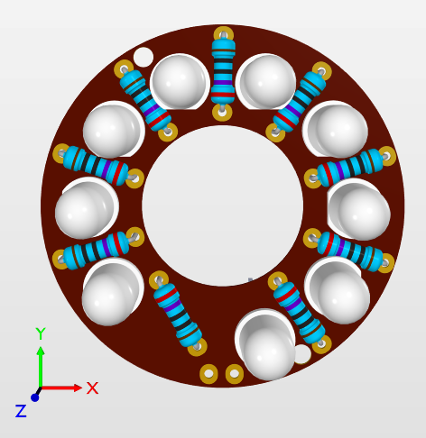

# Circular LED Lighting PCB

## Overview
This is a **single-layer circular PCB** designed for a lighting project.  
It features **9 5mm LEDs** with individual **¼W resistors**, arranged around an inner cutout for aesthetics or mounting purposes.

## Specifications
- **Outer Radius:** 18 mm  
- **Inner Cutout Radius:** 8 mm  
- **Layer Count:** 1 (single-layer)  
- **LEDs:** 9× 5 mm LEDs  
- **Resistors:** 9× ¼ W resistors (one per LED)  
- **Power Input:** 2× 2.5 mm pin header  
- **Mounting Holes:** 2× 3 mm holes  

## Features
- Compact circular design for decorative or functional lighting.  
- Easy single-layer layout for low-cost manufacturing.  
- Simple through-hole assembly for LEDs and resistors.  

## Visuals
| 3D View | PCB Tracks |
| ------- | ---------- |
|  |  |

## Usage
- Connect a suitable DC power source via the 2.5 mm pin header.
- Mount using the two 3 mm holes.
- Insert LEDs and resistors, solder in place, and enjoy the illumination.

## License
You are free to use and modify this design for personal or educational purposes.
